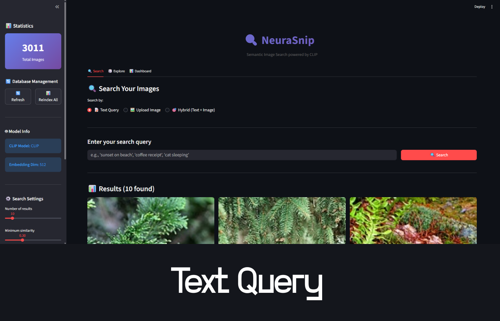
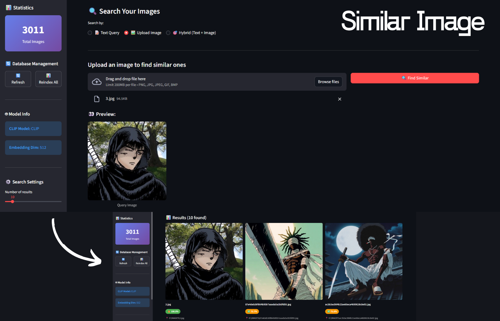
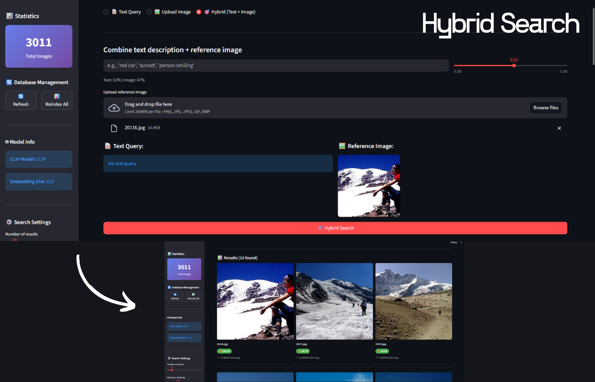
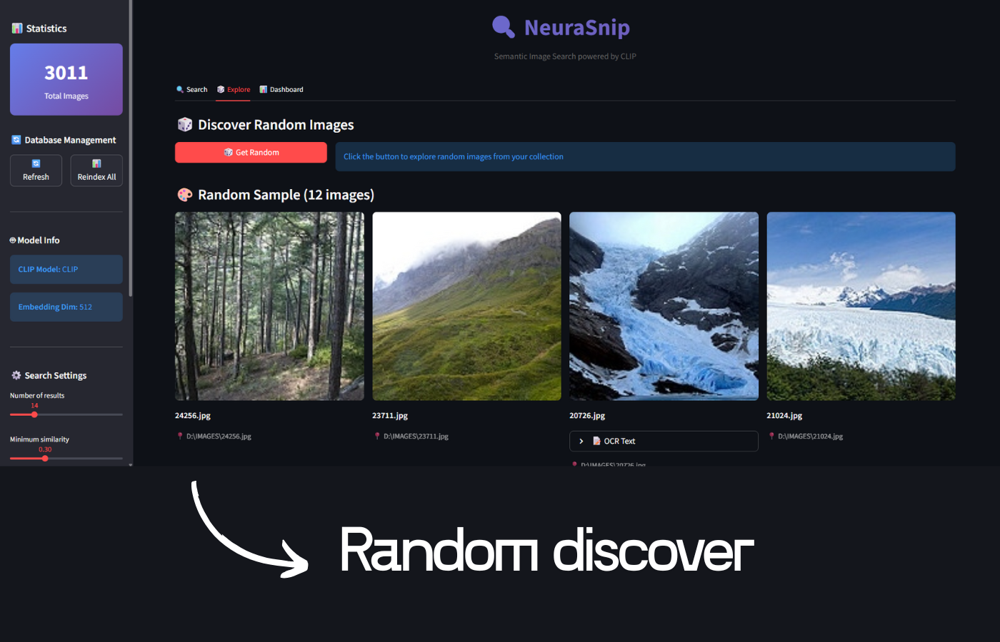
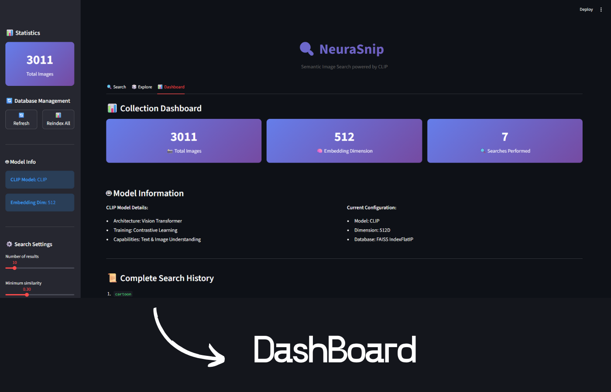
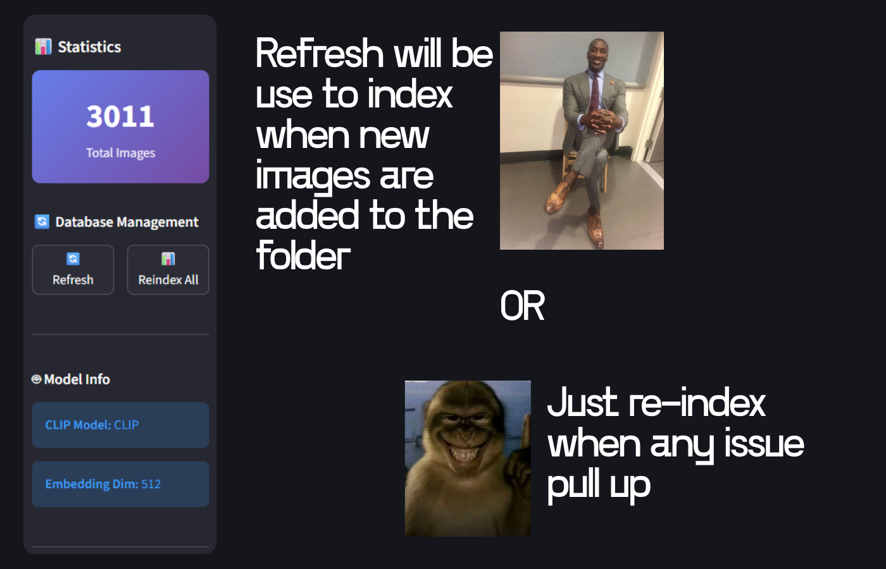

# 🔍 NeuraSnip - Semantic Image Search Engine

<div align="center">


**Search your images using natural language, powered by OpenAI's CLIP model**


</div>

---

## 🎯 What is NeuraSnip?

NeuraSnip is a **semantic image search engine** that understands what you're looking for, not just keywords. Search your personal photo collection using natural language queries like "sunset on beach", "person smiling", or "coffee shop receipt".

### 🌟 Key Features

-  **Semantic Search** - Search using natural language descriptions
-  **Image-to-Image Search** - Upload an image to find similar ones
-  **Hybrid Search** - Combine text + image for ultra-precise results
-  **OCR Integration** - Search text within images
-  **Beautiful UI** - Clean, modern Streamlit interface
-  **Fast Indexing** - Batch processing with progress tracking
-  **Vector Database** - Efficient FAISS-based storage
-  **Smart Filters** - Color detection and filtering
-  **Random Explorer** - Discover forgotten images

---

## 🚀 Quick Start

### Prerequisites

```bash
# Python 3.8 or higher
python --version

# Git (for cloning)
git --version
```

### Installation

```bash
# 1. Clone the repository
git clone https://github.com/yourusername/neurasnip.git
cd neurasnip

# 2. Create virtual environment
python -m venv venv

# 3. Activate virtual environment
# Windows (Git Bash):
source venv/Scripts/activate
# Windows (CMD):
venv\Scripts\activate
# Linux/Mac:
source venv/bin/activate

# 4. Install dependencies
pip install -r requirements.txt

# 5. Install Tesseract OCR (for text extraction)
# Windows: Download from https://github.com/UB-Mannheim/tesseract/wiki
# Linux: sudo apt-get install tesseract-ocr
# Mac: brew install tesseract
```

### First Run

```bash
# 1. Configure your image folder path
# Edit the path in src/indexer/image_indexer.py (line ~21):
images_folder: str = r"D:\YOUR_IMAGES_FOLDER"

# 2. Index your images
python -m src.indexer.image_indexer

# 3. Launch the web UI
streamlit run app.py

# 4. Open browser at http://localhost:8501
```

---

## 📖 Usage Guide

### 1️⃣ Text Search

Search using natural language descriptions:

<div align="center">
  
  <p><em>Natural language text search with relevance scores</em></p>
</div>

```python
# Example queries:
"sunset on beach"
"person wearing blue shirt"
"coffee shop receipt"
"cat sleeping on couch"
"document with text"
"group photo at party"
```

### 2️⃣ Image Search

Upload a reference image to find similar ones:

<div align="center">
  
  <p><em>Upload any image to find visually similar matches</em></p>
</div>

```python
# Use cases:
- Find duplicates
- Find all photos from a location
- Find similar compositions
- Match color palettes
```

### 3️⃣ Hybrid Search

Combine text description + reference image:

<div align="center">
  
  <p><em>Adjust text/image weights for precise control over search results</em></p>
</div>

```python
# Example:
Text: "person at landmark"
Image: [upload photo of Taj Mahal]
Result: All photos of people at Taj Mahal 
```

### 4️⃣ Random Explorer

Discover forgotten images with one click:

<div align="center">
  
  <p><em>Rediscover your photo collection with random sampling</em></p>
</div>

```python
# Perfect for:
- Rediscovering old photos
- Getting inspiration
- Random nostalgia trips
```

---

## 🏗️ Architecture

### Technology Stack

```
┌─────────────────────────────────────────────────┐
│                   Frontend                      │
│         Streamlit (Web Interface)               │
└─────────────────────────────────────────────────┘
                      ▼
┌─────────────────────────────────────────────────┐
│                Search Engine                    │
│  • Query Processing                             │
│  • Result Ranking                               │
│  • Hybrid Search Logic                          │
└─────────────────────────────────────────────────┘
                      ▼
┌──────────────────┬──────────────────────────────┐
│   CLIP Model     │    Vector Database           │
│   (ViT-B/32)     │    (FAISS IndexFlatIP)       │
│                  │                              │
│  • Text Encoding │  • Fast Similarity Search    │
│  • Image Encoding│  • 512D Embeddings           │
└──────────────────┴──────────────────────────────┘
                      ▼
┌─────────────────────────────────────────────────┐
│              Utilities Layer                    │
│  • Image Processor (PIL)                        │
│  • OCR Engine (Tesseract)                       │
│  • Color Detector                               │
└─────────────────────────────────────────────────┘
```

### Project Structure

```
neurasnip/
├── app.py                          # Streamlit web interface
├── requirements.txt                # Python dependencies
├── README.md                       # This file
│
├── src/                           # Core modules
│   ├── __init__.py
│   │
│   ├── models/                    # Neural network models
│   │   ├── __init__.py
│   │   └── image_embeddings.py   # CLIP model wrapper
│   │
│   ├── database/                  # Vector storage
│   │   ├── __init__.py
│   │   └── vector_db.py          # FAISS database
│   │
│   ├── indexer/                   # Image indexing
│   │   ├── __init__.py
│   │   └── image_indexer.py      # Batch indexer
│   │
│   ├── search/                    # Search engine
│   │   ├── __init__.py
│   │   └── search_engine.py      # Query processor
│   │
│   └── utils/                     # Utilities
│       ├── __init__.py
│       ├── image_processor.py    # Image handling
│       └── color_detector.py     # Color analysis
│
├── data/                          # Data storage
│   ├── images/                    # Sample images (optional)
│   ├── vector_store/              # Database files
│   │   ├── images.index          # FAISS index
│   │   └── images_metadata.pkl   # Metadata
│   └── logs/                      # Application logs
│
└── tests/                         # Unit tests (optional)
    └── test_search.py
```

---

## 🔧 Configuration

### Image Folder Path

Edit `src/indexer/image_indexer.py`:

```python
def __init__(
    self,
    images_folder: str = r"D:\YOUR_IMAGES_FOLDER",  # ← Change this
    db_path: str = "data/vector_store/images.index",
    batch_size: int = 32,
    skip_duplicates: bool = True,
):
```

### Model Selection

Change CLIP model in `src/models/image_embeddings.py`:

```python
# Available models:
"ViT-B/32"   # Fast, 512D (default)
"ViT-B/16"   # Better quality, 512D
"ViT-L/14"   # Best quality, 768D (slower)
```

### OCR Language

Configure OCR language in `src/utils/image_processor.py`:

```python
# English (default)
text = pytesseract.image_to_string(img, lang='eng')

# Other languages:
# French: lang='fra'
# Spanish: lang='spa'
# German: lang='deu'
```

---

##  Performance

### Indexing Speed

| Image Count | Batch Size 32 | Single Processing |
|-------------|---------------|-------------------|
| 100 images  | ~45 seconds   | ~2 minutes        |
| 500 images  | ~3 minutes    | ~10 minutes       |
| 1000 images | ~6 minutes    | ~20 minutes       |

### Search Speed

- **Text Query**: < 100ms
- **Image Query**: < 200ms
- **Hybrid Query**: < 300ms

*Tested on: Intel i7, 16GB RAM, No GPU*


##  Dashboard & Statistics

Track your image collection and search performance:


<div align="center">
  
  <p><em>Comprehensive analytics about your image collection</em></p>
</div>

### Features:
-  Total images indexed
-  Search history
-  Database size
-  Color distribution
-  Performance metrics

---


## 🔄 Database Management

### Real-time Progress Tracking


<div align="center">
  
  <p><em>Real-time progress tracking during image indexing</em></p>
</div>

### Features:
-  **Refresh Database** - Scan for new images
-  **Reindex All** - Rebuild entire database
-  **Live Statistics** - See progress in real-time
-  **Batch Processing** - Fast indexing with progress bars

---

##  Features Deep Dive

### 1. Semantic Understanding

```python
# Traditional keyword search:
Query: "cat"
Results: Only images with "cat" in filename ❌

# NeuraSnip semantic search:
Query: "cat"
Results: All images containing cats, even if 
         filename is "IMG_1234.jpg" ✅
```

### 2. Natural Language Queries

```python
# Works with complex descriptions:
"person wearing blue shirt at historic monument"
"sunset reflection on water with mountains"
"handwritten note on white paper"
"group of friends laughing outdoors"
```

### 3. Visual Similarity

```python
# Upload one beach photo
→ Finds ALL beach photos in your collection
→ Even with different angles, times, locations
```

### 4. OCR Text Search

```python
# Search text within images:
"receipt from Starbucks"
"invoice dated 2024"
"handwritten phone number"
"screenshot with code"
```

---

##  Advanced Usage

### Command Line Indexing

```bash
# Index with custom settings
python -m src.indexer.image_indexer --folder "E:\Photos" --batch-size 64

# Force reindex (skip duplicate check)
python -m src.indexer.image_indexer --skip-duplicates False

# Index specific folder
python -m src.indexer.image_indexer --folder "D:\Work\Screenshots"
```

### Programmatic Usage

```python
from src import SearchEngine

# Initialize
engine = SearchEngine(db_path="data/vector_store/images.index")

# Text search
results = engine.search_by_text("sunset", top_k=10)

# Image search
results = engine.search_by_image("reference.jpg", top_k=10)

# Hybrid search
results = engine.search_hybrid(
    query_text="beach",
    query_image="reference.jpg",
    text_weight=0.7,
    image_weight=0.3
)

# Get statistics
stats = engine.get_statistics()
print(f"Total images: {stats['total_images']}")
```

---

##  Troubleshooting

### Issue: "No module named 'clip'"

```bash
# Solution: Install CLIP
pip install git+https://github.com/openai/CLIP.git
```

### Issue: "Tesseract not found"

```bash
# Windows: Add to PATH
C:\Program Files\Tesseract-OCR

# Or specify in code:
pytesseract.pytesseract.tesseract_cmd = r'C:\Program Files\Tesseract-OCR\tesseract.exe'
```

### Issue: "CUDA out of memory"

```python
# Use CPU instead (in image_embeddings.py):
self.device = "cpu"  # Force CPU
```

### Issue: "Database not found"

```bash
# Reindex your images
python -m src.indexer.image_indexer
```

### Issue: "Images not appearing in search"

```bash
# Click " Refresh" button in Streamlit sidebar
# Or reindex from command line
python -m src.indexer.image_indexer
```

---

---

## 🤝 Contributing

Contributions are welcome! Please follow these steps:

```bash
# 1. Fork the repository
# 2. Create a feature branch
git checkout -b feature/amazing-feature

# 3. Commit your changes
git commit -m "Add amazing feature"

# 4. Push to branch
git push origin feature/amazing-feature

# 5. Open a Pull Request
```

### Development Setup

```bash
# Install dev dependencies
pip install -r requirements-dev.txt
```
---

##  License

This project is licensed under the MIT License .

---

##  Acknowledgments

- **OpenAI CLIP** - For the amazing vision-language model
- **FAISS** - For efficient vector similarity search
- **Streamlit** - For the beautiful web framework
- **Tesseract** - For OCR capabilities
- **PIL/Pillow** - For image processing

---

##  Contact

**Ayush Kumar** - (https://www.linkedin.com/in/mr-ayush-kumar-004/)

Project Link: [https://github.com/Ayushkumar111/neurasnip](https://github.com/Ayushkumar111/neurasnip)

---

If you find this project useful, please consider giving it a star! ⭐

---

<div align="center">

**Made with ❤️ and Python**

[Report Bug](https://github.com/Ayushkumar111/neurasnip/issues) • [Request Feature](https://github.com/Ayuskumar111/neurasnip/issues)

</div>